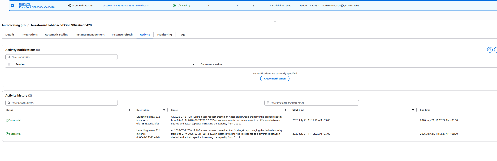
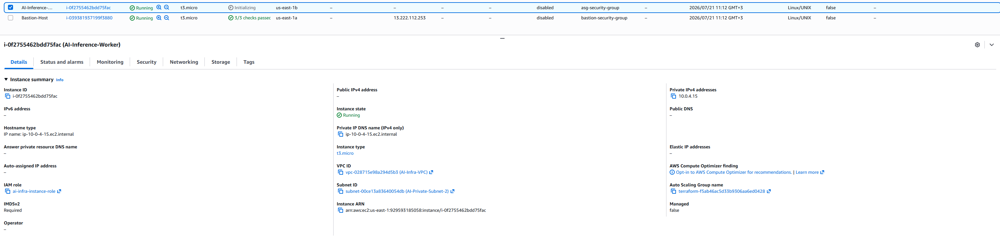

# 🚀 AI-Ready Scalable Inference Pipeline on AWS

> **Enterprise-grade, production-ready cloud infrastructure for hosting scalable AI inference workloads on Amazon Web Services (AWS), fully provisioned using Infrastructure as Code (Terraform).**


---

# 📖 Project Overview

This project demonstrates the design and deployment of a **secure, scalable, and highly available AWS infrastructure** optimized for AI inference workloads.

The entire environment is provisioned using **Terraform**, following Infrastructure as Code (IaC) best practices, making the deployment reproducible, maintainable, and production-ready.

The architecture emphasizes:

- High Availability (Multi-AZ)
- Security by Design
- Infrastructure Automation
- Horizontal Scalability
- Cost-efficient Cloud Architecture
- Enterprise Networking Best Practices

---

# 🏗️ Architecture

```text
docs/
└── architecture.png
```

```markdown

```

---

The infrastructure is deployed across **two Availability Zones** to ensure resilience and fault tolerance.

## Networking Layer

- Custom Virtual Private Cloud (VPC)
- Public Subnets
- Private Subnets
- Internet Gateway
- NAT Gateway with Elastic IP
- Route Tables
- Network Isolation between public and private resources

## Compute Layer

- Auto Scaling Group (ASG)
- Launch Template
- EC2 Worker Nodes
- Application Load Balancer (ALB)
- Dynamic Target Registration

## Storage Layer

- Amazon Elastic File System (EFS)
- Shared storage for AI models
- Persistent inference data
- Secure NFS mounting

## Security Layer

- IAM Roles following Least Privilege Principle
- Security Groups with minimal exposure
- AWS Systems Manager (SSM)
- Bastion Host for secure administration
- Private instances inaccessible from the Internet


# ✨ Features

- Fully automated Infrastructure as Code using Terraform
- Highly available Multi-AZ deployment
- Auto Scaling based on CPU utilization
- Load-balanced AI inference workers
- Secure VPC architecture
- Bastion Host managed through AWS SSM
- Shared Amazon EFS storage
- Least Privilege IAM configuration
- Security Groups with minimal attack surface
- Private compute resources with no direct Internet exposure
- Modular and reusable Terraform code
- Production-oriented cloud architecture

---

# ☁️ AWS Services Used

| Service | Purpose |
|----------|----------|
| Amazon VPC | Network isolation |
| EC2 | AI worker instances |
| Auto Scaling Group | Automatic scaling |
| Launch Template | Instance configuration |
| Application Load Balancer | Traffic distribution |
| Elastic IP | NAT Gateway |
| NAT Gateway | Internet access for private resources |
| Internet Gateway | Public connectivity |
| Amazon EFS | Shared persistent storage |
| IAM | Identity and access management |
| Security Groups | Firewall rules |
| AWS Systems Manager | Secure remote administration |
| CloudWatch | Metrics used for Auto Scaling |

---

# 📊 Infrastructure Components

The deployment provisions more than **30 AWS resources**, including:

- VPC
- Public Subnets
- Private Subnets
- Internet Gateway
- NAT Gateway
- Elastic IP
- Route Tables
- Route Associations
- Security Groups
- IAM Roles
- IAM Instance Profiles
- Launch Template
- Auto Scaling Group
- Scaling Policies
- Application Load Balancer
- Target Group
- Listener
- Amazon EFS
- Mount Targets
- Bastion Host
- CloudWatch Alarms

---

# 🔒 Security

Security is one of the core design principles of this project.

Implemented security measures include:

- Principle of Least Privilege (IAM)
- Private EC2 instances
- No direct SSH exposure
- AWS Systems Manager Session Manager
- Security Groups with strict ingress rules
- EFS accessible only from worker instances
- Network segmentation between public and private tiers
- Controlled outbound Internet access via NAT Gateway

---

# ⚡ Auto Scaling

The Auto Scaling Group automatically adjusts capacity based on demand using:

- Target Tracking Scaling Policy
- CPU Utilization Metrics
- Automatic instance replacement
- Health checks through the Load Balancer
- High availability across multiple Availability Zones

---

# 📂 Project Structure

```text
ai-ready-scalable-inference-pipeline/
├── terraform/
│   ├── vpc.tf          # Defines the core networking: VPC, public/private subnets, 
│   │                   # Internet Gateway, NAT Gateway, and Route Tables.
│   ├── security.tf     # Configures Security Groups (ALB, Bastion, Workers) and 
│   │                   # the Bastion EC2 instance resource.
│   ├── iam.tf          # Sets up IAM Roles, Instance Profiles, and policy attachments 
│   │                   # (including AmazonSSMManagedInstanceCore for keyless access).
│   ├── asg.tf          # Manages the Launch Template, Auto Scaling Group (ASG), 
│   │                   # and CPU-based Target Tracking scaling policies.
│   ├── alb.tf          # Configures the Application Load Balancer, target groups, 
│   │                   # listeners, and routing rules for the inference workers.
│   ├── efs.tf          # Provisions the Amazon Elastic File System (EFS) and mount 
│   │                   # targets for shared storage across private instances.
│   ├── outputs.tf      # Exposes crucial outputs such as ALB DNS name and VPC details.
│   └── variables.tf    # Defines configurable input variables (CIDR blocks, instance types, etc.).
└── docs/               # Contains architecture diagrams and execution proof screenshots.
```

---

# 📸 Project Screenshots

## Auto Scaling Group Activity

Demonstrates the Auto Scaling Group maintaining target capacity and monitoring instance health.



---

## Private Worker Instance

An EC2 AI inference worker securely running inside the private subnet and managed by the Auto Scaling Group.



---


# 🛠️ Technology Stack

- Amazon Web Services (AWS)
- Terraform
- EC2
- Auto Scaling Groups
- Application Load Balancer
- Amazon EFS
- IAM
- VPC
- Security Groups
- AWS Systems Manager
- CloudWatch

---

# 🚀 Deployment

## Clone the Repository

```bash
git clone https://github.com/your-username/ai-ready-scalable-inference-pipeline.git

cd ai-ready-scalable-inference-pipeline/terraform
```

---

## Initialize Terraform

```bash
terraform init
```

---

## Validate the Configuration

```bash
terraform validate
```

---

## Review the Execution Plan

```bash
terraform plan
```

---

## Deploy the Infrastructure

```bash
terraform apply
```

---

## Destroy the Infrastructure

To avoid unnecessary AWS charges:

```bash
terraform destroy
```

---

# 📈 Future Improvements

- ECS/Fargate deployment
- EKS (Kubernetes)
- GPU-based inference instances
- Blue/Green deployments
- CI/CD with GitHub Actions
- CloudFront integration
- AWS WAF
- ACM HTTPS certificates
- Amazon RDS
- Monitoring dashboards with Grafana
- Centralized logging using CloudWatch Logs

---

# 🎯 Learning Outcomes

This project demonstrates hands-on experience with:

- Infrastructure as Code
- AWS Networking
- Cloud Security
- High Availability
- Elastic Scaling
- Terraform Modules
- Production-ready Cloud Architecture
- Load Balancing
- IAM Best Practices
- Shared Storage with Amazon EFS

---

# 👨‍💻 Author

**Ben Keren**

Cyber & Cloud Infrastructure Student

---

# 📄 License

This project is intended for educational and portfolio purposes.